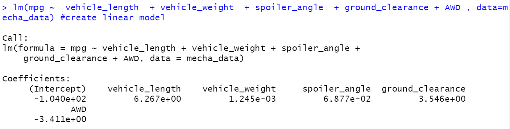
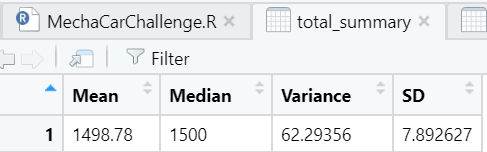
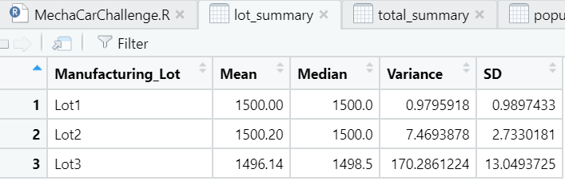

# MechaCar_Statistical_Analysis

## Linear Regression to Predict MPG
* Which variables/coefficients provided a non-random amount of variance to the mpg values in the dataset?
* Is the slope of the linear model considered to be zero? Why or why not?
* Does this linear model predict mpg of MechaCar prototypes effectively? Why or why not?

 

 

According to multiple linear regression results, vehicle length, ground clearance and intercept are statistically unlikely to provide random amounts of variance to the linear model. In other words the vehicle length and ground clearance have a significant impact on mpg of MechaCars.

The p-value of the linear regression analysis is 5.35X10^-11, which is significantly lower than assumed significance level of 0.05%. Hence we reject the null hypothesis and and deduces the slope of linear model is not zero.
Additionally multiple R-squared value is 0.7149, or 71.49% of the of the variablity of mpg (the dependent variable) is explained by using multiple linear regression model. Hence this is considered an effecitive model. 

## Summary Statistics on Suspension Coils
* The design specifications for the MechaCar suspension coils dictate that the variance of the suspension coils must not exceed 100 pounds per square inch. Does the current manufacturing data meet this design specification for all manufacturing lots in total and each lot individually? Why or why not?

 
The variance of suspension coils is 62.29 (or less than 100) PSI. As the variance is lower than 100 PSI it clearly meets the design specifications for the MechaCar suspension coils. 

 
The variance of suspension coils for lot 1 is 0.97, lot 2 is 7.46 and lot 2 is 170.286. Clearly Lot 1 and Lot 2 have variance significantly lower than design specification. However Lot 2 variance is 70% more than targeted design specification. 

## T-Tests on Suspension Coils
* Briefly summarize your interpretation and findings for the t-test results.

 

The t-test is performed to detemine if PSI across all manufacturing lots are statistically different from the population mean of 1,500 pounds per square inch. The p-value of 0.06028 is greater than predetermined significance of 0.05. Hence there is no evidence to reject the null hypothesis. In other words, PSI of all manufacturing lots are not statistically different than the population mean of 1,500 pounds per square inch. 

 
The t-test is performed to detemine if manufacturing **lot 1** PSI is statistically different from the population mean of 1,500 pounds per square inch. The p-value of 1 is greater than predetermined significance of 0.05. Hence there is no evidence to reject the null hypothesis. In other words, PSI of manufacturing lot1 is not statistically different than the population mean of 1,500 pounds per square inch. 

 
The t-test is performed to detemine if manufacturing **lot 2** PSI is statistically different from the population mean of 1,500 pounds per square inch. The p-value of 0.6072 is greater than predetermined significance of 0.05. Hence there is no evidence to reject the null hypothesis. In other words, PSI of manufacturing lot2 is not statistically different than the population mean of 1,500 pounds per square inch. 

 
The t-test is performed to detemine if manufacturing **lot 3** PSI is statistically different from the population mean of 1,500 pounds per square inch. The p-value of 0.04168 is less than predetermined significance of 0.05. Hence there is evidence to reject the null hypothesis. In other words, PSI of manufacturing lot3 is not statistically different than the population mean of 1,500 pounds per square inch. 

## Study Design: MechaCar vs Competition
Write a short description of a statistical study that can quantify how the MechaCar performs against the competition. In your study design, think critically about what metrics would be of interest to a consumer: for a few examples, cost, city or highway fuel efficiency, horse power, maintenance cost, or safety rating.
* What metric or metrics are you going to test?
* What is the null hypothesis or alternative hypothesis?
* What statistical test would you use to test the hypothesis? And why?
* What data is needed to run the statistical test?

In order to compare and quantify the MechaCar performance against the competition, we can collect data on mecha car's cost, fuel efficiency , maintenance cost  and safety ratings against the 4 different comptetitor vehicle data.

The 2 sample T-test will needed to be used because we assume the sample size for both Mecha car and comptetitor vehicle data will be large and we are testing against numerical data type. It is recommended to perform follwing T-tests.

1. 2 sample T-test can be performed against Mecha car cost against each competitor vehicle cost to determine following Null Hypothesis. .
Null Hypothesis: Mecha car cost is statistically different from the competitor vehicle cost 

2. 2 sample T-test can be performed against Mecha car fuel efficiency against each competitor vehicle fuel efficiency for following Null Hypothesis.
Null Hypothesis: Mecha car cost is statistically different from the competitor vehicle cost 

3. 2 sample T-test can be performed against Mecha car maintenance cost against each competitor vehicle maintenance cost  for following Null Hypothesis.
Null Hypothesis: Mecha car maintenance cost is statistically different from the competitor vehicle cost 

4. 2 sample T-test can be performed against Mecha car safety ratings against each competitor vehicle safety ratings for following Null Hypothesis.
Null Hypothesis: Mecha car safety ratings is statistically different from the competitor vehicle safety ratings. 
 
 